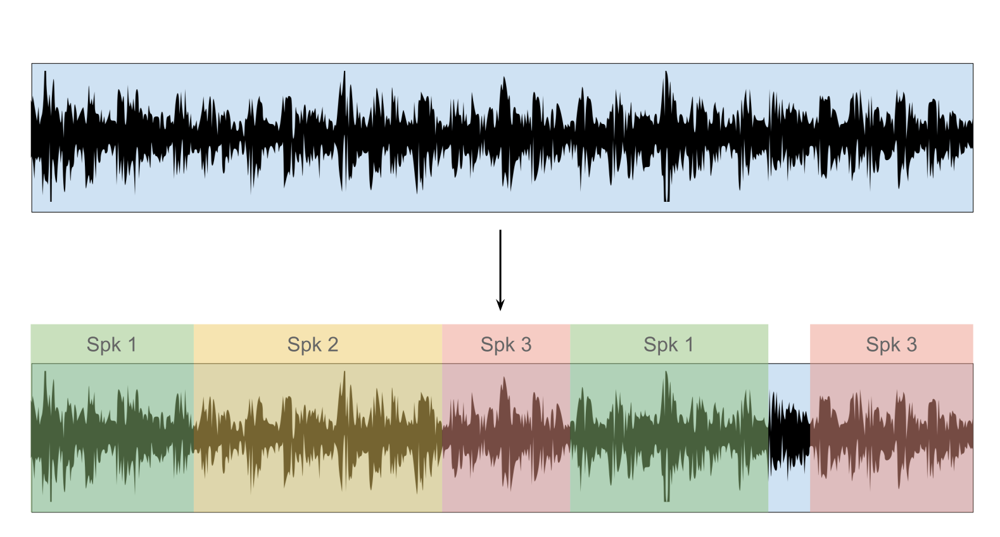

% Average Window Smoothing for an Indonesian Language Online Speaker Identification System
% Cil Hardianto Satriawan; Dessi Puji Lestari
% School of Electrical Engineering and Informatics, Institut Teknologi Bandung

# Abstract

Online speaker diarization is the process of determining 'who spoke when'
given an ongoing conversation or audio stream, in contrast to the offline
scenario where the conversation has concluded and the entire file is available.
The process of constructing an Indonesian language online speaker identification
system is explored, from corpus development to software design and testing.
The system conducts speaker identification directly on low-energy separated
segments and employs a rolling window of time-weighted average likelihoods to
improve accuracy, resulting in a system with a latency of one speaker segment
for predictions. Experimentation against a standard baseline offline system
resulted in speaker error rates (SER) of 25.5% and 19.3% for the proposed
online and baseline offline systems, respectively.

*Keywords*: Speaker identification, Indonesian, online, average window

# 1 Background

Speaker diarization and identification is the process of determining 'who spoke
when', for instance in a conference or interview setting. Speaker diarization
usually refers to the task of taking audio containing speech from one or more
speakers and determining which parts are spoken by which speakers, after which
speaker identification can be performed to determine identity. In
online speaker identification, there is the additional constraint of producing
these identities in a timely manner, be it at regular time intervals or at
certain speech boundaries. Online speaker diarization differs from offline
speaker diarization mainly in the amount of information available for
analysis; online diarization makes use of all data available up to the
current time, whereas for offline diarization data at all time points is
available.

Offline speaker diarization is well-established, with systems assessed on
evaluation challenges such as the National Institute of Standards and
Technology (NIST) Rich Transcription evaluation. Most
approaches in speaker diarization are centred around the process of
converging towards an optimum number of clusters corresponding to speakers,
either from very few clusters (top-down) or from a large number derived from
speaker segments (bottom-up). In the more common bottom-up approach, the
diarization process is typically broken down into a number of steps:

1. Speaker segmentation, alternatively speaker change detection or speaker turn
detection, splits the audio at points where speaker changes occur. Hence each
resulting segment contains speech from a single speaker. In this approach,
distance-based metrics
are calculated between adjacent audio blocks to determine whether the blocks
originate from a single speaker. Commonly used metrics include the Bayesian
information criterion (BIC), generalized likelihood ratio (GLR), and Kullback-
Leibler (KL or KL2) divergence.
2. Speaker clustering, where segments belonging to the same speaker are grouped
together. The label of the resulting clusters corresponds to a speaker, though
the identity is undetermined at this point. In an offline setting, hierarchical
clustering is usually performed.
3. Post-processing methods are used to improve predictions; non-speech segments
can be classified and excluded from clustering, Viterbi decoding can be used to
estimate the most likely sequence of clusters, and so on.

This process is illustrated in @Fig:diar: As seen in the lower picture, the
incoming signal is split into 5 voiced segments and 1 unvoiced segment, and
is subsequently clustered to obtain the speaker labels for each segment. In the
case of speaker identification, the process is performed on the clusters to
obtain the actual speaker identities.

{#fig:diar}

The standard approach to speaker identification is similar to that in speaker
verification; a Gaussian Mixtures Model (GMM) representing the vocal
characteristics of the average person is first trained from a large number of
speakers, and is dubbed the universal background model (UBM). For each user
to be identified, the training vectors derived from the user's speech are
adapted to the UBM's parameters by performing maximum a posteriori
(MAP) adaptation. This process is described in greater detail in @reynolds2000.

Newer systems have adopted the usage of total variability statistics originally
developed for the speaker verification domain to achieve results comparable
to the aforementioned approaches while discarding the need for complicated
back end post-processing @dehak2010. In this approach, the most salient
features in the low-dimensional i-vector space are extracted and exploited to
allow for more accurate clusterings.

Online speaker diarization is important when real time or close to real time
information regarding speakers is required. Paired with online speech
recognition, for example, it becomes possible to generate a transcription of an
ongoing conference or meeting. The clustering step is useful in obtaining
speaker clusters, which can boost speech recognition when speaker adaptation is
performed. Other uses include the addition of real time or close to real time
machine translation and summarization.

Unfortunately, many approaches that are standard in offline diarization
cannot be used in an online setting, or require some modification. For instance,
the hierarchical clustering used in offline diarization requires full knowledge
of the data to be clustered beforehand. In addition, some of the speaker
segmentation methods depend on smoothing the resulting metrics first, as in
@delacourt1999 or depend on the analysis of large audio buffers which may not
be feasible due to latency constraints.

In addition, most existing research is developed and built upon existing
evaluation challenges, such as the aforementioned NIST Rich Transcription
evaluation, in which blind diarization is assumed, where the number and
identities of speakers are unknown a priori. However, for the purpose of
meeting diarization it is generally assumed that there is a closed set of
participants, with a priori knowledge available. The assumptions are therefore
more closely aligned with speaker verification.

This research describes the process of constructing an online speaker
diarization and identification system for meeting transcription. The system
has a priori knowledge of the speakers to be identified, and must give speaker
predictions in a timely manner to server as a visual guide for meetings.
The remainder of this study is organized as follows: Section 2 discusses
related research and the design of the system to be built, in particular with
regards to online speaker segmentation and identification post-processing.
Section 3 describes the process of building the speaker corpus, including data
collection and annotation, and Section 4 discusses the experimental setup and
results, comparing between the proposed system and a baseline offline system.

# 2 Online Diarization System

## 2.1 Related research

Several different approaches have been explored in online speaker diarization.
In a series of papers, Liu et al. explored the adaptation of the standard
diarization pipeline for online and real time usage. Fast speaker change
detection is achieved with a phone-class decode followed by Bayesian
information criterion (BIC) calculation with additional penalty factor in @liu1.
As hierarchical clustering requires knowledge beforehand of all clusters, it is
implausible to implement in an online setting. Instead, a modification of
k-means clustering is employed to achieve online clustering in @liu2. In this
approach, new clusters (speakers) are formed whenever a segment is found to be
sufficiently distant from any existing cluster means, whereas existing cluster
means are continuously updated with incoming data. Online speaker adaptation
and identification are discussed in @liu3, where Maximum Likelihood Linear
Regression (MLLR) is used to adapt existing clusters and to accumulate
statistics for the identification of subsequent segments. In this approach, no
prior knowledge regarding the number of speakers of speaker characteristics is
necessary.

With the capabilities of modern graphic processing units (GPU), it is possible
to approach the diarization problem in a brute-force manner, by offloading most
computationally expensive tasks to the GPU. In @friedland2012, all of the
standard offline steps are reproduced for each incoming block of data, but as
the GPU is able to process at thousands of times the rate of real time, it is
essentially real time.

## 2.2 Design and Analysis

One of the larger difficulties with speaker diarization, specifically the
clustering step, is the assumption of previously unknown speakers and an
unknown number of speakers. Hence, in this research, given the domain of
meeting transcription and known prior speakers, we attempt to eschew the
clustering step in favor of direct identification on speaker segments. This
allows for much less complexity at the cost of reduced accuracy.

In addition, the diarization system should be easily integrated into existing
workflows. Specifically, the system should act as middleware to a real time
signal processing pipeline. In this way, the low-level specifics of signal
input/output and communication are handled by the pipeline framework. This also
allows for greater extensibility of the system to related functionality, such
as speech recognition, machine translation, or automatic summarization. An
example of the finished system is shown in @Fig:pipeline.

{#fig:pipeline}

The Perisalah system, an Indonesian language speech recognition system, was
chosen as the starting point for its functional online component, developed
from the Kaldi GStreamer Server by @alumae2014. The Transcriber application in
@rahman2017, developed from the Kaldi Offline Transcriber, although similar in
functionality, lacks an online diarization component. The system developed for
this research essentially extends the aforementioned systems to allow for
functional online diarization.

## 2.3 Online speaker segmentation

In practice, speaker segmentation mostly succeeds in guaranteeing individual
segments contain at most one speaker, but fails to ensure consecutive segments
belong to different speakers.

For online diarization, a custom GStreamer plugin is developed for speaker
segmentation, separating the input audio stream at low energy points in the
signal. In this method, features are extracted from audio blocks and the log
energy portion of the resulting frames are analyzed. If the average energy is
below a specified threshold, the block is considered silent. After a specified
number of blocks of silence have passed, the audio blocks buffered up to that
point are segmented.

The energy threshold portion of the algorithm depends on the signal-to-noise
ratio (SNR) of the acoustic environment which is relatively static, and can be
set according to the conditions of the environment beforehand. The silence
length threshold (denoting the number of consecutive silent blocks to
tolerate), on the other hand, is easily disrupted in cases where speakers
interrupt each other regularly in conversations. Hence, a number of different
methods for speaker segmentation were also tested, namely Kullback-Liebler (KL
or KL2) as discussed in @siegler1997 and penalized Generalized Likelihood Ration (GLR)
thresholding as used in @delacourt1999, which are not solely influenced by energy.

Segments obtained this way are then run through the LIUM speaker identification
program and the most likely speaker predicted. Provided the segmentation is
reasonably accurate, directly running speaker identification on speaker
segments while forgoing the clustering step leads to time performance gains at
a low cost to identification accuracy.

## 2.4 Windowed average predictions

There are a number of shortcomings to direct speaker identification on speaker
segments, stemming primarily from the low amount of audio data available for
analysis at any given segment. By considering only the current segment, we
are also discarding information from the prediction of previous segments. This
often results in noisy predictions, with correctly identified longer segments
interspersed with misidentified short segments.

A simple post-processing method is devised to partially alleviate this problem,
which involves calculating the most likely speaker within a rolling window of
segments. The process is illustrated in greater detail in @Fig:window.
The window to be considered consists of the segment at the current time _t_ and
the _n - 1_ segments preceding it. The speaker likelihoods _S_ for each segment in
the window are weighted against the length _l_ of the segment. These time-weighted
scores are then summed across the segments of the window for each speaker; the
speaker with the highest score is the prediction for the current segment.

{#fig:window}

It is important to discard speaker likelihoods beyond a specified number of
segments, as global time-weighted average scores are necessarily biased towards
speakers who have spoken more overall. The size of the rolling window is
therefore an important heuristic, signifying the amount of local context to
consider; too large a value misses short speaker turns, while too
small a value negates the benefits of applying a window in the first place.
The window size should ideally be set according to the median amount of
segments spoken per speaker. Unfortunately, this cannot be known a priori.
Empirically, a window of size three lead to a sizeable increase in accuracy for
the tested corpus.

Although this method provides an easy boost to accuracy at low computational
cost, more sophisticated methods such as batched k-means clustering or newer
methods such as time-delay neural networks (TDNN) and long short-term memory
(LSTM) networks are likely to produce better results, as they have the
advantage of considering all previous data instead of the data within a small
window. A hybrid diarization/identification system is also plausible, with
an existing speaker model used as cluster initializations for a Dirichlet
Process Gaussian Mixture Model (DPGMM) of speakers.

# 3 Corpus Development

## 3.1 Corpus Background

A speaker identification corpus was built for the purpose of this research,
with data taken from audio recordings of the meetings of the Indonesian
Regional Representation Council (Dewan Perwakilan Daerah Republik Indonesia)
throughout 2014 and 2015. These recordings were provided by PT Inti, an
Indonesian telecommunication state company, with whom we have jointly developed
portions of the Perisalah speech recognition system *ref*. A total of 57
separate meetings were recorded during this time period, 30 of which were
chosen for this research.

These meetings, which are open to the public, are held by members of the
Regional Representation Council (DPD) to discuss various national concerns
related to regional representation in the passing of new laws. The committee
primarily serves a legislative function, including monitoring and budgeting,
specifically in relation to regional aspirations. In addition to their primary
function, the council is also occasionally called upon to resolve conflicts
between regional stakeholders and the government. The subject matter and
structure of the meetings can generally be classified into one of the
following topics:

1. Expert consultation sessions. Experts in relevant fields are called upon to
assess the current status of the issue being discussed and are asked to present
their topic of expertise. These meetings will typically consist of one or more
experts presenting their topics uninterrupted, before concluding with a
question and answering session.
2. Discussing recommendations. These meetings are typically heavily moderated
discussion sessions, whereby the moderator goes through the prepared document
in sections and calls upon the relevant teams for clarification, before opening
discussion to the floor for that section. Although still relatively structured
due to the moderation, these meetings can at times produce portions of
overlapping speech.
3. Summons. Government officers are summoned to discuss issues related to their
performance or regarding matters of importance.
4. Conflict resolution. This involves a hearing between two sides in a conflict
usually regarding settlements related to land rights. The two sides are called
upon to make statements regarding the issue before the council, after which
the council will discuss the issue.
5. Internal sessions. These are usually meetings to discuss internal matters,
for instance with regards to scheduling future meetings, deadlines, diplomatic
visits to various regions, et cetera.

An overview of the meetings is presented in @Tbl:tbl1.

Meeting ID        Topic                         Type
---------------   ----------------------------  ------------
2,3               Mother and child healthcare   Consultation
4,10,32,46        Scheduling                    Internal
5                 Tax ministry                  Summon
6,34,48           Tax law revisions             Discussion
7                 Bank Indonesia governor       Summon
8                 National auditing report      Discussion
9,18              Budget office                 Consultation
11,12,13          Budget office                 Discussion
21,29,30,49,50    Koperasi                      Consultation
38                Koperasi                      Discussion
33,40             Budget recommendations        Discussion
44                Land dispute                  Conflict
45,127            Agriculture ministry          Summon
53,57             National planning             Discussion

: Meetings information {#tbl:tbl1}

## 3.2 Pre-processing

The meetings were recorded using the Perisalah system, which combines the audio
from numerous microphones into a single channel and stores them for further
processing. These recordings were first converted to 16 kHz 16-bit WAV audio
for ease of storage and access. In the process, the audio was high pass
filtered at 100 Hz to reduce low frequency noises such as rumbling and pops.
In addition, loudness leveling was applied across recordings to ensure equal
average loudness between meetings and to prevent clipping of the signal. In
particular, loudness leveling is important if signal level/energy is an audio
feature. The audio recordings were then analyzed to determine the total
duration of speech they contained, as meetings were often preceded, succeeded,
and occasionally punctured by long stretches of silence.

## 3.3 Annotation

The annotation of training data was conducted in a semi-supervised and
iterative manner. This was due mainly to the difficulty of identifying speakers
across meetings, and also to reduce the time-costly manual labeling of speaker
segment boundaries. The LIUM speaker diarization toolkit, discussed in
@rouvier2013 and @meignier2009 was utilized for most
of the training, specifically for speaker modeling and identification and the
initial speaker clustering and labeling. Various Python scripts were also
utilized for feature extraction, as seen in @torfi2017, annotation and data analysis.

A single speaker clustering run was conducted on the pre-processed audio to
obtain the initial predictions for speaker segment boundaries and speaker
labels. Each segment in each meeting was then labeled manually to obtain
speaker labels and genders. For the purposes of this research, speaker segment
boundaries were not altered. Instead, segments with overlapping speakers were
marked and omitted from training and testing, and hence do not contribute to
the final error rate. As such, it is assumed that the segment boundaries
derived from the speaker segmentations process was accurate.

In the first labeling iteration, speaker labels were attached to each segment
by listening through the recordings and manually assigning a label. Due to
human limitations, it was difficult to ensure speaker labels were consistent
across files/meetings. Instead, an iterative approach was taken where:

1. Each meeting is labeled locally, with speaker labels that apply only for
the given file.
2. Each (local) speaker label is assumed to belong to a unique speaker across
all meetings and is automatically assigned a unique label.
3. A speaker model is trained from a given amount of speech from each unique
speaker.
4. The speaker model is cross-verified and a prediction produced.
5. Manually cross-check reference for incorrect speaker hypotheses; for
reference speaker labels with multiple hypothesized speaker labels, check if
the multiple hypothesized labels actually belong to the same speaker.
6. Manually assign a unique speaker label for such speakers, and modify the
reference to reflect this unique label. Hence, this step is an attempt to
label speakers consistently across meetings.
7. Repeat from step 2, but do not automatically assign a label to speakers
manually edited in step 6.

In this way, the reference was iteratively improved until mislabeled
speakers were no longer encountered. @Fig:fig2 illustrates this process, with
data elements and processes depicted in rectangles and ellipses, respectively.

{#fig:fig2}

In total, 236 speakers were identified. Due to the cross-checking method above,
though, speakers with a lack of training data could not be verified, and there
may be a number of double-counted speakers. The corpus contains 42.81 hours of
speech, discounting silence, noise, and overlapping speaker segments. On
average, each speaker has around 653.1 seconds of speech. However, due to the
moderated nature of the meetings a small number of speakers contributed a large
part of the recorded speech.

# 4 Experiment and Results

## 4.1 Overview and Evaluation Metrics

Experiments were conducted to ascertain the difference in speaker prediction
accuracy between the online speaker diarization system and a baseline offline
system. Both systems utilized the speaker model obtained in Section 3.3. The
online system utilizes a different speaker segmentation method, essentially
dividing the input audio stream at quiet sections and running speaker
identification directly on these short segments whilst forgoing the clustering
step. The baseline system utilizes the standard setup and is discussed below.
Accuracy evaluation was conducted on a per frame basis as speaker segment
boundaries and positions differed between the two methods.

The experiments are evaluated on Speaker Error Rate (SER), calculated as the
percentage time (in terms of frames) wrongly attributed to another speaker. As
the reference is labeled at the speaker segment level and not at the frame
level, and due to the differences in speaker segmentation between the various
systems, segment alignment between the hypothesized segments and reference
segments is necessary.

## 4.2 Speaker Model

The speaker model was built using various amounts of speaker training data from
the corpus, with validation testing conducted on the remainder of the speaker's
data.
It is desirable to use the minimum amount of speech per speaker in training the
speaker model, as this correlates to a shorter enrollment time in real life
usage. Hence, speaker models using 60, 90, and 120 seconds of training data per
speaker were trained and tested. For each of these models, the steps are as
follows:

1. For each speaker in the cleaned corpus, determine whether enough speech data
is available for training; if a speaker has spoken for less
than 60, 90, or 120 seconds throughout the entire corpus, they are excluded
from training *and* testing.
2. If enough data is available, set aside the first 60, 90, or 120 seconds of
speech for training and the rest for testing. Note that this may be problematic
when speakers' voices change throughout the meeting, or when the first minute
of speech has insufficient tonal variation.
3. Run maximum a priori (MAP) adaptation against a suitable universal
background model (UBM) for all speaker training data, resulting in a final
speaker model containing all speakers. As an appropriate separate Indonesian
language corpus was unavailable, the UBM was pre-built from a different source.
4. Evaluate the speaker model using the test data set aside in step 2 by
calculating the per frame speaker identification accuracy. The results of this
step are detailed in @Tbl:tbl2.

Training data (s)   SER (%)   # Speakers
----                ------    ----
30                  49.12     223
60                  21.71     201
90                  13.62     178
120                 13.21     157
150                 10.15     138
180                 11.65     123

: Speaker model validation {#tbl:tbl2}

There is a difference between speaker model training on a corpus and training
through speaker enrollment. When training on a corpus, as the amount of
training data per speaker is increased, a larger proportion of speakers can no
longer be trained and tested. This is noted in @Tbl:tbl2, which notes the number
of speakers trained and tested. Also, whereas in this case the speech taken for
each speaker's training is from the very beginning of their turns, in speaker
enrollment we have the opportunity to obtain speech according to our specific
needs. For instance, as speakers can often be discriminated from the sound
of their vowels, we may want to provide a sentence containing mostly vowels
for enrollment, which is not possible in corpus training without utilizing a
phoneme recognizer beforehand. In this way, it is possible to obtain better
results in less time through enrollment.

## 4.3 Baseline System

The baseline system utilizes the standard LIUM toolkit setup to implement
offline speaker diarization using data obtained from the corpus discussed in
Section 3. This process has been covered in depth in @meignier2009, with the
relevant configuration for this experiment as follows:

1. Feature extraction with 12 Mel-Frequency Cepstral Coefficients (MFCC) in
Sphinx format from 16 kHz audio files with additional energy, delta, and
delta-delta information calculated during pre-processing. Feature warping,
cepstral mean normalization (CMS), and variance normalization are applied on a
300 frame sliding window for robustness purposes.
2. Initial speaker segmentation, followed by classification of speech, music,
and silence segments.
3. GLR-based segmentation followed by linear and hierarchical clustering of
resulting speaker segments.
4. Segment adjustment by modeling the speaker clusters as Gaussian mixtures
models (GMM) and running Viterbi decoding.

In the standard setup, these steps are succeeded by segmentation into speech
and non-speech areas and gender/bandwidth detection. However, these steps were
omitted in this setup as they were deemed unnecessary; non-speech is labeled as
noise
in the corpus and gender/bandwidth was irrelevant for the scope of the study.
Instead, the re-segmented portions were used to evaluate the accuracy of the
system.

The system is evaluated by decoding and identifying the corpus assembled in
Section 3, with the results displayed in Table 3. It should be noted that
because the speaker model itself is built from this data, portions of the
training data are evaluated by the system. This equally applies to the online
system.

## 4.4 Proposed System

The online system implements a simple voice activity detector (VAD) to detect
the beginnings and endings of utterances, splitting the incoming audio stream
into a separate segment whenever voice activity is not detected. LIUM toolkit
is then used to run speaker identification on the segment against the speaker
model obtained in Section 4.1. For the current utterance, the system outputs
the most likely speaker calculated over a sliding window.

In detail, the process can be broken down into the following steps:
1. Analyze the incoming audio stream to detect voice activity.
2. When a portion of the signal is voiced, keep the samples in a separate
buffer.
3. When a silent/non-voiced portion of the signal is encountered, if the
silence is preceded by a voiced portion and if the length of silence exceeds a
specified threshold, write the buffer to a file. This is our speaker segment.
4. Run speaker identification on the segment against the speaker model obtained
in Section 4.1, storing the likelihood of *all* speakers.
5. Take all speaker predictions from the previous *n* segments or *t* time,
whichever is shorter, and calculate the average score for each speaker in this
period. The highest scoring speaker is output as the prediction for this
segment.

The results of the baseline and proposed systems for the 90, 120, and 150
second speaker models is detailed in @Tbl:tbl3.

Model Method      SER (%)
----  ---------   ------
90    online      38.21
      3-win       30.76
      5-win       29.92
      base        21.05
120   online      34.93
      3-win       27.03
      5-win       25.52
      base        18.48
150   online      31.41
      3-win       24.60
      5-win       24.92
      base        19.59

: Speaker diarization and identification results for the various systems {#tbl:tbl3}

Of note, the results of baseline system evaluation are consistently superior to
the proposed system. The simplicity of the speaker segmentation method employed
in the proposed system results in often inaccurate segments, specifically
during periods of back and forth conversation. This is mitigated somewhat by
the windowing method used, which on average results in a small improvement in
accuracy. However, accuracy improvements quickly subside with larger window
sizes. Furthermore, this method breaks down in more dynamic conversations,
where speaker turns occur more rapidly.

# 5 Conclusion

In this research, the development of an Indonesian language diarization corpus
and the construction of an online speaker diarization system is explored in
detail. The resulting corpus is available for research purposes to the
Indonesian public. For the purpose of meeting transcription, a speaker model was
built using the corpus data, from which further corrections to the corpus were
made.

A simple online system utilizing energy-based speaker segmentation and MAP
adapted GMM-based speaker identification was constructed, with window-averaged
predictions to boost speaker prediction accuracy. The system is then tested and
compared against a baseline offline speaker diarization system. Results show
that the offline system retains the advantage in terms of prediction accuracy,
although it requires knowledge of the entire audio stream beforehand. On a
speaker model derived from 150 seconds of user speech, the online system with
a 3-segment window produced a SER of 24.6% compared to 19.59% for the baseline
system.

# 6 Bibliography
